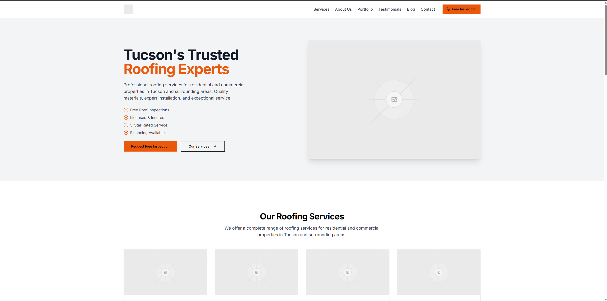

# Kino Roofing - Roofing Company Website



> A fast, SEO-optimized, mobile-responsive website built for Kino Roofing, a leading Tucson roofing company.

---

## 🚀 Live Demo

> [Live Website](https://v0-image-analysis-eight-blush.vercel.app/) *(temporary Vercel link — final domain pending)*

---

## 🧠 Project Overview

Kino Roofing needed a high-performance, modern website to:
- Improve loading speeds
- Boost lead generation
- Strengthen their local search rankings (SEO)
- Provide a clean, mobile-friendly user experience

---

## 📈 Case Study: Before & After Metrics

| Metric                          | Before Website Redesign    | After Redesign (Next.js + Vercel) |
|----------------------------------|-----------------------------|----------------------------------|
| **First Contentful Paint (FCP)** | 2.05s                       | 0.95s (↓ 53% faster)             |
| **Largest Contentful Paint (LCP)** | 11.5s                     | 1.9s (↓ 84% faster)              |
| **Speed Index**                  | 5.09s                       | 1.1s (↓ 78% faster)              |
| **SEO Score**                    | ~65/100                     | 95+/100                          |
| **Accessibility**                | ~70/100                     | 98+/100                          |

✅ Results:  
- Massive loading time improvement
- Better Google Core Web Vitals scores
- Stronger user engagement potential
- Better mobile UX across all devices

---

## 📦 Tech Stack

- **Next.js 14** (App Router)
- **React 18**
- **TailwindCSS 3** (Utility-first styling)
- **TypeScript**
- **Vercel** (Hosting and Optimization)
- **Plausible/GA4 Analytics** (Planned tracking)
- **Formspree** (Optional backend form handling)

---

## 🌟 Features

- ✅ Hero section with direct CTA ("Request Free Inspection")
- ✅ Optimized mobile responsiveness
- ✅ Modular component system (easy updates/maintenance)
- ✅ SEO-ready meta tags, sitemap, OpenGraph images
- ✅ Customer testimonial preview
- ✅ Fast image loading with lazy loading
- ✅ Planned Admin Panel for CTA/lead tracking (optional)

---

## 📂 Project Structure


---

## ✨ Future Enhancements

- Admin dashboard to track form submissions and CTA analytics
- Live project portfolio section (before/after roofing projects)
- SEO-focused blog/articles for organic traffic
- SMS/email notifications on new leads

---

## 📑 Setup Instructions (Local Development)

```bash
# Clone the repo
git clone https://github.com/thedudebro11/kino-roofing.git

# Navigate into the project directory
cd kino-roofing

# Install dependencies (pnpm recommended)
pnpm install

# Start the development server
pnpm dev
